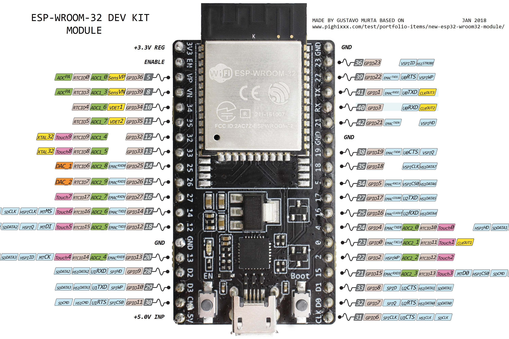

# Lab 2: Intro to wireless communication with Blynk

This lab will introduce you to controlling your Arduino from a phone app using the Blynk framework. In the future, you may build your own servers and clients to interface with your devices, but Blynk is a free and simple way to prototype apps quickly.

We will continue using the ESP32 Devkit 4 provided in this class. If you blow it up (it happens) they're available in the TIW vending machine for 5 dollars. Documentation for the specific board we're using is [here](https://docs.espressif.com/projects/esp-idf/en/latest/hw-reference/get-started-devkitc.html). This lab will be done individually. You will clone the assignment from the class Github, add your code, answer the questions in `Report.md`, and push it when you're done.

## ESP32 Pinout

 **Note: Whenever I refer to a pin number in this document, I am referring to the GPIO pin, shown in brown.**

## Required Reading

Read sections 16.1-16.3, 16.5 of [Valvano's chapter on the Internet of Things.](http://users.ece.utexas.edu/~valvano/Volume1/E-Book/C16_InternetOfThings.htm) This will help you answer the questions in the report.

**It is very important that you read this lab document and all the examples closely. Almost all of the code to complete the lab is provided in this document. Some information is redundant. You need to decide what code is necessary for your application and make changes as necessary (e.g. to match your virtual pins).**

**In industry and future courses, you will receive requirements documents and some example code with minimal documentation. It takes practice to figure out what you need to complete your project. This lab is an exercise in reading documentation to figure it out. You may need to read sections multiple times. Note that the code is provided in snippets, not sketches!**

## Setting up Blynk

1.  Download and install the Blynk app on your phone. It is available for both Android and iOS.

2.  Open the Blynk app on your phone. Make an account and create your first app. Get the authentication token. Blynk says they email it to you but it often won't go through, so just copy it and email it to yourself.

3.  In the Arduino IDE, open Library Manager. Sketch \> Include Library \> Manage Libraries. Search for Blynk. Install Blynk by Volodymyr Shymanskyy.

4.  Now we will test your connection. Open the provided BlynkStarter.ino sketch. Copy your blynk auth key into `auth[]`. Write your WiFi credentials in ssid and pass.

    Note: You will **not** be able to use utexas wifi, because of the network security settings. There are a few IoT hotspots around EERC, in the Maker Space and in the Embedded Systems Lab. For the IoT Lab:

    ```C
    char    ssid[32]        = "EE-IOT-Platform-02";
    char    pass[32]        = "g!TyA>hR2JTy";
    ```

    Another alternative is to use your own mobile hotspot. This is usually the most reliable option.

5.  Compile and upload BlynkStarter.ino with your credentials. On your Blynk app, you should see a device connected!

## Procedure A: WiFi Communication

WiFi is an ubiquitous wireless communication standard you will find practically everywhere. Nowadays, there is an access point about every 20 feet (at least in urban areas). It is defined by the IEEE 802.11 standard, and uses 2.4 GHz or 5 GHz radio bands. This is because the 2.4GHz band was originally licensed by the government as the "ISM" or Industrial-Scientific-Medical band, which permitted anyone free reign to do what they wanted with it. Hence, Microwave ovens also use this frequency, since they came before WiFi.

1.  Add a button, a slider, a display and a terminal to your Blynk app.
2.  Set the virtual pins for these widgets. Virtual pins are how your ESP32 is going to distinguish the widgets from each other. By default, pins 0 - 9 are already set up for you. You can choose what pins you use for what, but make sure you know what they all are.
3.  The Blynk framework abstracts a lot of the nitty gritty away for you, so you only need to define functions that do stuff when the ESP32 receives data from your phone, or when you want to send data to your phone. Use the code snippets from below to write your program. Your program should:
    1. Turn the LED on and off with the button
    2. Change the LED brightness with the slider (note the button interaction)
    3. Display a message typed on the Arduino Serial Monitor on the Blynk terminal
    4. Display the uptime of the ESP32 in seconds

# Understanding Blynk

   Blynk is an Arduino library that provides classes and functions for interfacing with its mobile app via the internet.  Blynk is event based and runs behind the scenes. In lab 1, we used the `delay()` function in the `loop()` to control timing. Because Blynk is event based, using `delay()` will mess up the timing and break it. These next sections show how to accomplish certain tasks with Blynk _asynchronously_. In this context, asynchronous means that events can happen at any time and will not be blocked by other functions for significant amounts of time.

   An important concept to understand is the separation of interface and implementation. An interface defines how a function is called, and is usually in a header file. The implementation describes what the function actually does. The Blynk framework has several functions where you get to decide what they do, but Blynk decides how and when they're called. Blynk is providing the _interface_, while you provide the _implementation_. WRITE, READ, and Timer are described below and are examples of this concept.

## Virtual Pins

   Blynk has created an abstract data type that contains everything you need to interface with virtual pins. The virtual pins are #defined in the Blynk header files, so you can call them by their names, V0, V1, etc. Be sure to document what pins you used in the Blynk app for each widget.

## Blynk Write

   `BLYNK_WRITE` is an asynchronous function that is executed whenever a virtual pin is written to. Specifically, when the Blynk phone App is writing data to a virtual pin. It is an event handler that you tell what to do, and don't have to worry about calling anywhere, Blynk takes care of that. When you press the button on your phone, a 1 is written to a virtual pin. You want your ESP32 to know when that happens so it can turn on the LED. When the write event occurs, the `BLYNK_WRITE(pin)` function is executed so your ESP32 will know that pin has been written to. Example:

```C
// This function executes whenever V1 is written to.
// You don't need to call it. Blynk handles the trigger for you.
BLYNK_WRITE(V1)
{

    // param is a member variable of the Blynk ADT. It is exposed so you can read it.
    int pinValue = param.asInt(); // assigning incoming value from pin V1 to a variable

    // Because V1 is a button, pinValue will be a 0 or a 1.
    if (pinValue == 0) {
        // turn LED off
    }
    else {
        // turn LED on
    }
}
```

   When you write code inside the BLYNK_WRITE() function, you are essentially injecting that code into the Blynk framework. They give you the interface, you write the implementation.

## Blynk Read

The opposite of Blynk write is Blynk read. In this case, the mobile app requests data from the ESP32. Again, you don't need to ever call it, you would just need to tell it what to do. Example:

```C
// This function is executed whenever Blynk pin V5 requests data from the ESP32
BLYNK_READ(V5) // Widget in the app READS Virtal Pin V5 with the certain frequency
{
    // This command writes Arduino's uptime in seconds to Virtual Pin V5
    Blynk.virtualWrite(5, millis() / 1000);
}
```

## Non-Blocking LED Fade

   We need to use PWM to fade the LED, but we can't use delays in the loop like we did before. When we used delays, we made our PWM function "Blocking". This means that nothing else can run while it is running, effectively wasting time we could spend elsewhere. Thankfully, the ESP32 has hardware built in that allows us to automatically output PWM signals on every pin! This means we can just write a duty cycle to a register, set it and forget it, no delaying necessary. Use `ledcWrite(pinChannel, dutyCycle)` to control your LED. To turn your LED off, write 0 or a number outside of the resolution range (i.e. 1024) **Note: we are not using the same led interface as in lab 1. This library works differently.** This is the ESP32 LED Channel interface. You define a PWM channel (0-15) with a frequency and resolution (recall lab 1) and then attach it to a specific GPIO pin. Then you control the _channel_, not the GPIO pin. Example:

```C
#define LED 2

const int freq = 5000;     // 5KHz frequency is more than enough. Remember we used 100 before.
const int ledChannel = 0;  // You can have up to 16 pwm channels (0 to 15)
const int resolution = 10; // 10 bit resolution for 1023. Freq should be greater than resolution.

// Note the different pin setup function!
void setup() {
    // configure LED PWM functionality
    ledcSetup(ledChannel, freq, resolution);

    // attach the channel to the GPIO to be controlled
    ledcAttachPin(LED, ledChannel);
}

// If virtual pin 2 controls fade value, 0 to 1023.
BLYNK_WRITE(2)
{
    // param is a member variable of the Blynk ADT. It is exposed so you can read it.
    int val = param.asInt(); // assigning incoming value from pin V1 to a variable
    ledcWrite(ledChannel, val); // Note that this takes ledChannel as an argument, NOT the pin! Set duty = val.
}
```

## Sending data periodically

   Sometimes you will want to periodically read a value from your ESP32 and display it. E.g. you're collecting data from a sensor, and you want to display it on the Blynk App. The Blynk Timer abstracts a hardware timer for you, all you need to give it is a period and a function to call each period. Below is example code using the Blynk Timer to create a periodic event, during which you can send whatever data you want.

```C
// You will need to define a timer object. BlynkTimer uses your MCU hardware to create a timer
// that is compatible with all the Blynk events.
BlynkTimer timer;

// This function sends Arduino's up time every second to Virtual Pin 0.
// In the app, Widget's reading frequency should be set to PUSH. This means
// that you define how often to send data to Blynk App.
void myTimerEvent()
{
// You can send any value at any time.
// Don't send more than 10 values a second or the Blynk server will block you!
    Blynk.virtualWrite(V0, millis() / 1000); // Write the arduino uptime every second
}

// You need to initialize the timer interval and set your function as the handler in setup
void setup()
{
    // Debug console
    Serial.begin(115200);

    Blynk.begin(auth);

    // Setup a function to be called every second
    timer.setInterval(1000L, myTimerEvent);
}

// You need to start your timer in the loop.
void loop()
{
    Blynk.run();
    timer.run(); // Initiates BlynkTimer
}

```

## The Blynk terminal

   Blynk makes interacting with the Blynk Terminal easy. You just need to write strings to the virtual pin associated with it. This will display string messages on it. Just like in Lab 1's UART example, you will need to periodically check if Serial data is available. Previously, we did this in the loop. But now we can't put anything in the loop that isn't Blynk, so instead we will use a periodic timer event. It is possible to do multiple periodic events with only one timer: Use a counter and whenever it is divisible by a factor, do an action. Example:

```C
int time_count = 0; // timer counter global variable
String content = "";  // null string constant ( an empty string )

void myTimerEvent() // Every 10 ms
{
    if (time_count % 25 == 0) { // every 250 ms
        // Do thing that needs to happen every 0.25 seconds
    }
    if (time_count == 100){
        // Do thing that needs to happen every 1 second
        time_count = 0; // reset time counter
    }
    else {
        // Send serial data to Blynk terminal
        char character;
        while(Serial.available()) { // Check if serial is available every 10 ms
            character = Serial.read();
            content.concat(character);
        }
        if (content != "") {
            Blynk.virtualWrite(virtual_pin, content);
            content = ""; // Clear String
        }  
    }
    time_count += 1; // Increment on every tick
}

// You need to initialize the timer interval and set your function as the handler in setup
void setup()
{
    // Debug console
    Serial.begin(115200);
    Blynk.begin(auth);
    // Setup a timer with function to be called every 10ms
    timer.setInterval(10L, myTimerEvent); // 10 ms interval
}

// You need to start your timer in the loop.
void loop()
{
    Blynk.run();
    timer.run(); // Initiates BlynkTimer
}
```

## A few specific hints

To meet the requirements, I used:

* A global for LED state
* A global for current duty cycle
* A global Blynk Timer object
* A global time counter variable
* A global String object for holding messages
* A timer event function
* two BLYNK_WRITE functions- one for slider, one for button

There are many ways to achieve the desired result. You may not need to use all those globals.

**Deliverables: Your Arduino code and completed `Report.md`**
