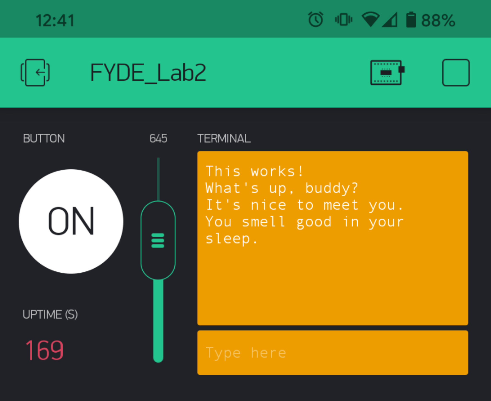

Name: Zahid Hossain

EID: zh4757

Team Number: 8

## Questions

1. What is the purpose of an IP address?

    It helps to identify a unique machine on a network

2. What is a DNS? What are the benefits of using domain names instead of IP addresses?

    It's a lookup service that maps a symbolic name to its corresponding IP address. It makes it easier to remember a machine as opposed to using just using the numbers of an IP address.

3. What is the difference between a static IP and a dynamic IP?

    answer

4. What is the tradeoff between UDP and TCP protocols?

    TCP has higher latency, but UDP makes it easier to miss data without recovery

5. Why can't we use the delay function with Blynk?

    Blynk is event based, and tasks are completed asynchronously. delay() would mess up and break timing

6. What does it mean for a function to be "Blocking"?

    A function that is "Blocking" is one that prevents any other function from being run while the current function is running

7. Why are interrupts useful for writing Non-Blocking code?

    Interrupts let you run a task without having to block the execution of main code.

8. What is the difference between interface and implementation? Why is it important?

   The interface defines how we call functions, and the implementation describes what the function does. The difference is important because it governs how a programmer will have to approache completing a task based on the interface they are using and the implementation they are trying to achieve.

9. Screenshot of your Blynk App:

    
